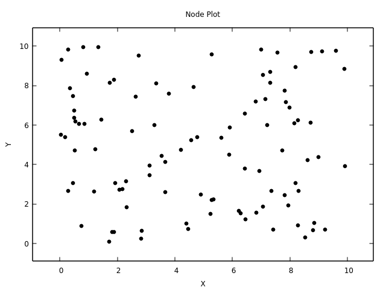
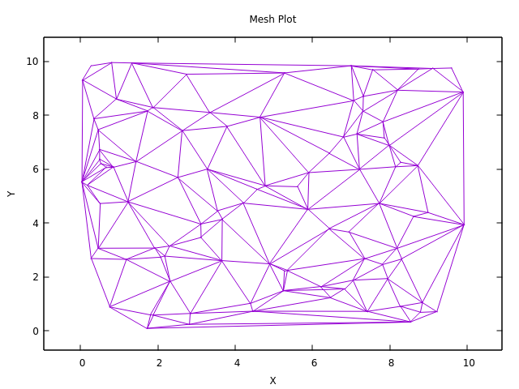
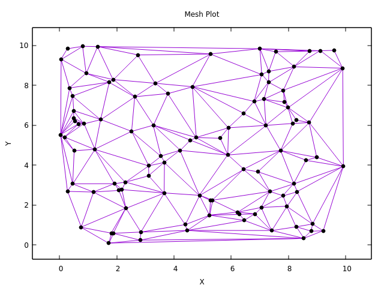
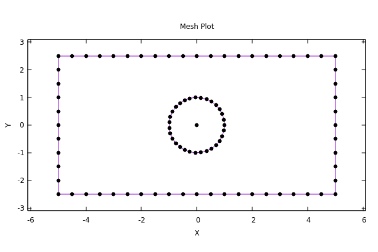
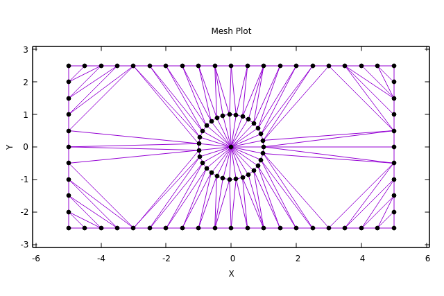
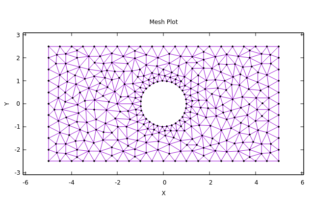

# Trimesh

Implementation of an algorithm for meshing 2D domains using triangular elements.
- Delaunay triangulation performed using Bowyer-Watson algorithm. [1, 2]

  
  
  

- Ruppert's mesh refinement algorithm implementation to improve mesh quality and detail. [3] 

  
  
  

# References

[1] A. Bowyer, ‘Computing Dirichlet tessellations’, The Computer Journal, vol. 24, no. 2, pp. 162–166, Feb. 1981.

[2] D. F. Watson, ‘Computing the n-dimensional Delaunay tessellation with application to Voronoi polytopes’, The Computer Journal, vol. 24, no. 2, pp. 167–172, Feb. 1981.

[3] J. Ruppert, ‘A Delaunay Refinement Algorithm for Quality 2-Dimensional Mesh Generation’, Journal of Algorithms, vol. 18, no. 3, pp. 548–585, May 1995.